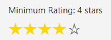
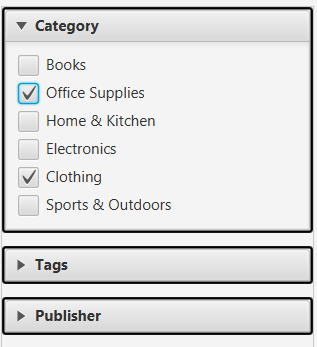
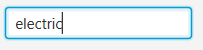

# Access and Use

## Build/Run
For instructions on how to run the application and required system specs, see [Build.pdf](build.pdf)

## Using The Application
The program will firstly take a minute give or take to boot. Most of this time is spent filling the `SimilarItemsGraph`, a process that looks at exactly 46120 edges between items. This number is $\binom{961}{2}$ as there are 961 items, and there is one edge attempted between each.

### Filters 
Upon launch you will have the following options to filter items
- Price (Minumum and Maximum)
  - 
  - By dragging and dropping the two slider nubs, a minimum and maximum price can be selected. Note that the minimum and maximum prices are always rounded to the nearest dollar.
- Minimum Rating (1-5 Stars)
  - 
  - By clicking on a star, the minimum rating is set to that star index (1 star = 1 minimum rating, 2 stars = 2 minimum rating, etc.). Clicking on the same star again will reset the minimum rating to 0.
- Categorical Data (Category, Tags, and Publisher)
  - 
  - By clicking on any of the options in the category, tags, or publisher lists, the user can select or deselect that option as a filter. Multiple options can be selected at once, and the user can use the search bar above each list to quickly find an option.
  - 4 tags are assigned to each item. When filtering, an item must have all selected tags. If more than 4 tags are selected, no items will be shown.
  - Each item has exactly 1 category and 1 publisher. When filtering, an item must have the selected category and publisher to be shown, but there is no limit to how many categories and publishers can be selected at once.
- Search Query
  - 
  - The serach field allows the user to enter a query. The BM25 algorithm is used and all items get a score. The highest score gets selected, and items whose scores is less than 15% of the highest score get filtered out. This allows precise queries to have less results, while broad queries can have many results.
