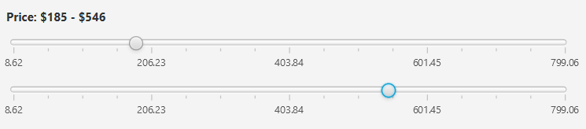
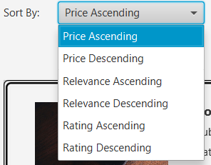

# Access and Use

## Build/Run
For instructions on how to run the application and required system specs, see [build.md](build.md). The application can run on a variety of operating systems, and there is simply some minimum technical requirements to be met. This project was developed on a laptop with 16GB of RAM and Windows 11 as the operating system. It is multithreaded, as it uses a seperate thread for JavaFX rendering. While the app is not very resources intensive, the RAM used will increase as the `RecentlyViewedItemsWindow` gets filled up to capacity. At launch prior to any inputs, approximately 1.5GB of RAM is used, and this increases up to 4.4GB of RAM when the `RecentlyViewedItemsWindow` is filled to capacity and the `SimilarItemsContainer` is filled.

## Using The Application
The program will firstly take a minute give or take to boot. Most of this time is spent filling the `SimilarItemsGraph`, a process that looks at exactly 46120 edges between items. This number is $\binom{961}{2}$ as there are 961 items, and there is one edge attempted between each.

### Filters 
Upon launch you will have the following options to filter items
- Price (Minumum and Maximum)
  - 
  - By dragging and dropping the two slider nubs, a minimum and maximum price can be selected. Note that the minimum and maximum prices are always rounded to the nearest dollar.
- Minimum Rating (1-5 Stars)
  - 
  - By clicking on a star, the minimum rating is set to that star index (1 star = 1 minimum rating, 2 stars = 2 minimum rating, etc.). Clicking on the same star again will reset the minimum rating to 0.
- Categorical Data (Category, Tags, and Publisher)
  - 
  - By clicking on any of the options in the category, tags, or publisher lists, the user can select or deselect that option as a filter. Multiple options can be selected at once, and the user can use the search bar above each list to quickly find an option.
  - 4 tags are assigned to each item. When filtering, an item must have all selected tags. If more than 4 tags are selected, no items will be shown.
  - Each item has exactly 1 category and 1 publisher. When filtering, an item must have the selected category and publisher to be shown, but there is no limit to how many categories and publishers can be selected at once.
- Search Query
  - 
  - The serach field allows the user to enter a query. The BM25 algorithm is used and all items get a score. The highest score gets selected, and items whose scores is less than 15% of the highest score get filtered out. This allows precise queries to have less results, while broad queries can have many results.

### Sorting
#### Comparators

Several different comparators are used to sort the items. The options permitted are the following.
- Relevance (ascending and descending)
- Price (ascending and descending)
- Rating (ascending and descending)
- 

### Analyzing Results

When the **Search** button is selected, the program takes in all of the filters and the comparator choice and applies them to the data. A full diagram of the process can be found here: [Search Sequence Diagram](../search_sequence.png)

The sequence is as follows.
1. Data is gathered from UI elements into a `HashMap` and passed to the `SearchEngine` class.
2. The `SearchEngine` class applies the filters in the following order, with each filter being applied to the results of the previous filter. After each filter is applied, the number of items remaining is printed to the console.
   1. Price Filter
   2. Minimum Rating Filter
   3. Categorical Filters (Category, Tags, Publisher)
   4. Search Query Filter
3. The `Sorter` class is used to sort the results based on the selected comparator. If the size of the items is less than or equal to 25, `InsertionSort` is used. If the size of the items is greater than 25, `QuickSort` is used.
4. The UI is updated with the sorted and filtered items.
5. Keep an eye on the console, as many details about the process are printed, such as the search data pulled from the UI and the number of items remaining after each filter is applied.