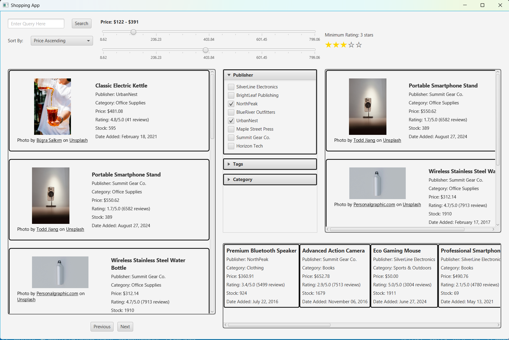

# Software Engineering Problem Being Addressed
## Shopping Application
This application serves to give the user a way to select and shop for items. The design is based off of any typically online shipping website, with many common features included such as various filters, search queries, and similar items being displayed. The application allows users to browse through a full 961 different items. The software engineering problem here comes from the need for data structures and algorithms. As you will see in later docs, the application relies heavily on key data structures and algorithms in order to operate correctly.
## Some Issues Addressed
- Quick Access to Data
  - A HashMap is used to store all entity data upon reading in from the CSV file and allow for near constant lookup time.
    - It is not pure constant as a search can look through a handful of items in the same bucket before finding the right item.
- Sorting Results
  - The Quick Sort and Insertion Sort algorithms are employed in order to properly sort the data.
- Holding Pages of Searched Items
  - A LinkedList is used to hold many different pages of items.

